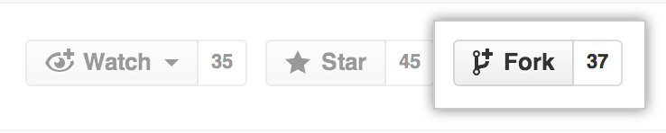
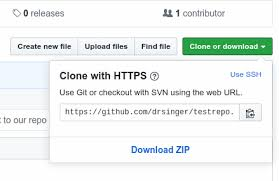
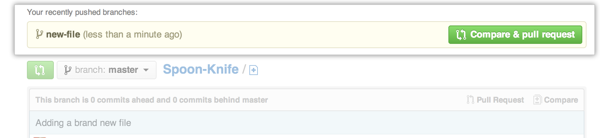
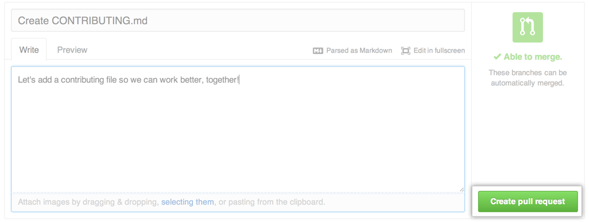

# Guildlines for contributing

## Step by step guide

1. Fork this repo to your GitHub account
   

2. Clone or Download the forked repo to your local machine  
   

3. Set **remote origin** if you have downloaded the repo via a zip file

> **Note:** If you're pasting the URL in Git Bash consider right click and paste. `Ctrl + V` on Git Bash adds invisible characters to the remote origin URL and corrupts the link

```
git remote add origin <your_forked_repo_url>

# To check whether the remote was successfully added
git remote -v
```

4. The next is to set **upstream origin**. Upstream is the original repo that you forked. Adding a link to it allows you to pull any new commits from the **Original repo(upstream)** so you can resolve any merge conflicts before making a PR

```
    git remote add upstream <original_repo_url>

    # To check if the upstream was successfully added
    git remote -v
```

5. Do the necessary changes and make a PR with detailed description of which issues are addressed in the PR
   
   

## Development prerequisites

1. The first step is to ensure you have NodeJS ([download link](https://nodejs.org/en)), Git Bash for Windows ([download link](https://git-scm.com/downloads)) and a text editor of your choice installed on your local machine

2. Open the `spotify-clone` folder that you cloned or downloaded in the previous steps

3. Change directory into the **client** folder `cd client` and run `npm install` to install all the necessary project dependencies

4. Navigate to `client/src/config/spotify.js` and change the value for **redirect_uri** from `https://spotify-clone12.netlify.app` to `http://localhost:3000`

> The **redirect_uri** is the URL to which the app is redirected to after the login is authorized. If the value isn't changed then the app will be redirected to the production application and you won't be able to see the changes you make in development environment

5. For seamless development experience and avoid logging in on every refresh you can login once and then open **Chrome Dev Tools (Ctrl + Shift + I)** and switch to the Console Tab. On the first line the **access_token** is printed you can copy that and replace the **token** value in the `client/src/reducer.js`. This will allow you to access the application without logging in again and again until the token expires and no data is pulled dynamically.
